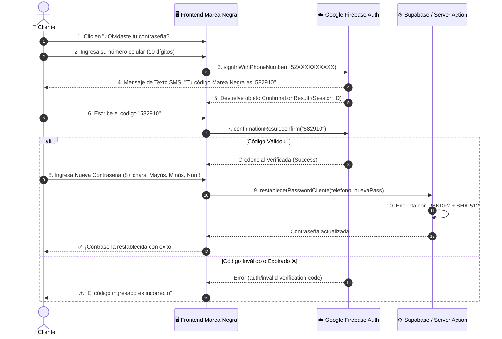

# 🔐 Autenticación, Seguridad y Recuperación de Contraseñas (OTP SMS)

Guía técnica de la arquitectura de autenticación y seguridad para **Marea Negra - Aguachiles**.

---

## 📑 Tabla de Contenidos
1. [Visión General](#1-visión-general)
2. [Recuperación de Contraseña con OTP SMS (Firebase)](#2-recuperación-de-contraseña-con-otp-sms-firebase)
   - [¿Cómo funciona la comparación del código OTP?](#cómo-funciona-la-comparación-del-código-otp)
   - [Diagrama de Secuencia](#diagrama-de-secuencia)
   - [Configuración de Firebase Phone Auth](#configuración-de-firebase-phone-auth)
3. [Cambio de Contraseña de Clientes VIP](#3-cambio-de-contraseña-de-clientes-vip)
4. [Cambio de Contraseña de Administradores](#4-cambio-de-contraseña-de-administradores)
5. [Políticas de Seguridad y Encriptación](#5-políticas-de-seguridad-y-encriptación)

---

## 1. Visión General

La plataforma maneja dos niveles de autenticación:
- **Panel Administrativo (`/admin`)**: Autenticación gestionada por **Supabase Auth** con control de roles (`admin`, `empleado`) y políticas de seguridad RLS (Row Level Security).
- **Club de Lealtad VIP de Clientes (`/micuenta`, `/registro`)**: Autenticación por número celular de 10 dígitos y contraseñas hasheadas con algoritmo salado **PBKDF2 + SHA-512**.

---

## 2. Recuperación de Contraseña Costo $0 MXN (WhatsApp & Cumpleaños)

Para eliminar cualquier costo de SMS de operadoras telefónicas y no requerir tarjetas de crédito en servicios como Firebase, el sistema cuenta con dos métodos de verificación nativos **100% gratuitos e instantáneos**:

### 🟢 Método A: Código de Seguridad por WhatsApp ($0 MXN)
1. **Solicitud**: El cliente introduce su celular de 10 dígitos.
2. **Generación Local**: El servidor genera un código criptográfico de 6 dígitos con expiración de 15 minutos en la tabla `codigos_recuperacion`.
3. **Despacho Directo**: Se abre WhatsApp con el mensaje pre-armado hacia el bot/administrador.
4. **Validación**: El cliente ingresa el código en la pantalla web. El servidor valida que el código no haya sido utilizado ni haya expirado, y actualiza la contraseña con hash PBKDF2/SHA-512.

### 🎂 Método B: Verificación Inmediata por Cumpleaños (0 Espera / 0 Mensajes)
1. El cliente introduce su celular y su **Fecha de Cumpleaños** registrada en el Club VIP.
2. El servidor compara la fecha contra la base de datos de Supabase.
3. Si coincide, autoriza el cambio de contraseña en 3 segundos sin necesidad de enviar ningún mensaje.

---

## 3. Asignación y Restablecimiento Directo por el Administrador (`/admin/clientes`)

Si un cliente acude al mostrador o solicita apoyo por WhatsApp porque olvidó su contraseña, el personal administrativo o cajero puede:

1. Ingresar a **Clientes & CRM** ([`/admin/clientes`](file:///Users/mariovaldezdev/marea-negra/app/admin/clientes/page.tsx)).
2. Buscar al cliente por nombre o celular y presionar el botón 🔑 **"Clave"**.
3. Escribir una nueva contraseña o presionar **"🎲 Generar Aleatoria"** (ej. `Aguachile77*`).
4. Al guardar, el sistema encripta la clave con PBKDF2/SHA-512 y ofrece el botón directo **"📲 Enviar Clave por WhatsApp al Cliente"** con mensaje pre-armado.


### Diagrama de Secuencia



### Configuración de Firebase Phone Auth

En tu archivo `.env.local`:
```env
NEXT_PUBLIC_FIREBASE_API_KEY=tu-api-key-de-firebase
NEXT_PUBLIC_FIREBASE_AUTH_DOMAIN=tu-proyecto.firebaseapp.com
NEXT_PUBLIC_FIREBASE_PROJECT_ID=tu-proyecto-id
NEXT_PUBLIC_FIREBASE_STORAGE_BUCKET=tu-proyecto.appspot.com
NEXT_PUBLIC_FIREBASE_MESSAGING_SENDER_ID=1234567890
NEXT_PUBLIC_FIREBASE_APP_ID=1:1234567890:web:abcdef123456
```

En la consola de Firebase:
1. Ve a **Authentication** > **Sign-in method**.
2. Habilita el proveedor **Phone (Teléfono)**.
3. Agrega tu dominio de producción en **Authorized domains** (ej. `marea-negra.com`, `localhost`).

---

## 3. Cambio de Contraseña de Clientes VIP

Disponible dentro de la sesión de socio en `/micuenta` mediante el botón **"🔑 Cambiar Clave"**:
- **Componente**: `components/auth/CambiarPasswordModal.tsx`
- **Server Action**: `cambiarPasswordCliente(telefono, passwordActual, nuevaPassword)`
- **Validaciones**:
  1. Verifica que la contraseña actual coincida con el hash almacenado en `clientes_club.password_hash`.
  2. Valida los 4 requisitos de fortaleza de la nueva contraseña.
  3. Previene que la nueva contraseña sea idéntica a la anterior.

---

## 4. Cambio de Contraseña de Administradores

Disponible en el pie del Sidebar administrativo (`app/admin/layout.tsx`):
- **Componente**: `components/auth/CambiarPasswordAdminModal.tsx`
- **Método**: `supabase.auth.updateUser({ password: nuevaPassword })`
- **Alcance**: Actualiza de forma inmediata las credenciales de acceso para el dashboard, cocina, caja y gestión de mesas.

---

## 5. Políticas de Seguridad y Encriptación

1. **Hash Salado**: Las contraseñas de socios se encriptan con **PBKDF2** utilizando **100,000 iteraciones** y digestión **SHA-512** con salt criptográfico único por usuario (`lib/security/passwordHash.ts`).
2. **Requisitos de Complejidad**:
   - Mínimo 8 caracteres.
   - Al menos 1 letra mayúscula (A-Z).
   - Al menos 1 letra minúscula (a-z).
   - Al menos 1 número (0-9).
3. **Prevención de Exposición**: Teléfonos de soporte y endpoints no se renderizan como texto estático indexable gracias al hook cliente `useWhatsAppSupport.ts`.
