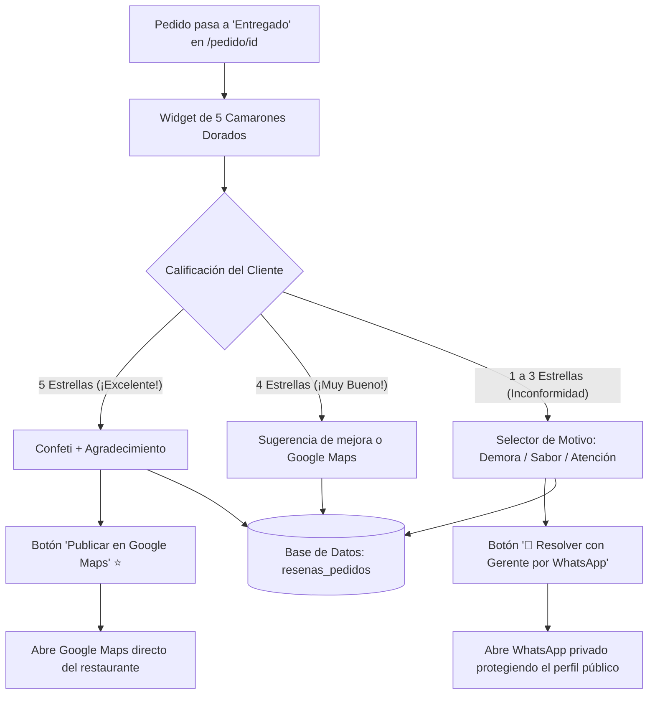

# ⭐ Sistema Inteligente de Reseñas & Google Maps Booster (Reputación 4.9★)

Módulo de fidelización y protección de reputación online diseñado para **Marea Negra - Aguachiles**.

---

## 🎯 Objetivo de Negocio

1. **Maximizar las reseñas de 5 estrellas en Google Maps:** Lograr una calificación sobresaliente que atraiga a turistas y locales en Sinaloa.
2. **Filtrar y desviar quejas en privado (Shield Anti-Mala Reseña):** Evitar que clientes con inconformidades menores dejen 1 o 2 estrellas públicas en internet, canalizándolos directamente a un chat privado de WhatsApp con la gerencia para ofrecerles una solución inmediata.

---

## 🧭 Flujo de Funcionamiento



---

## 🗄️ Esquema de Base de Datos (`resenas_pedidos`)

```sql
create table resenas_pedidos (
  id serial primary key,
  pedido_id int references pedidos(id) on delete cascade,
  cliente_telefono text,
  calificacion int not null check (calificacion between 1 and 5),
  motivo text,
  comentario text,
  canal_destino text check (canal_destino in ('google_maps', 'whatsapp_soporte', 'interno')),
  created_at timestamptz default now()
);
```

---

## ⚙️ Variables de Entorno Opcionales

Puedes configurar la URL directa a la ficha de reseñas de Google Maps de Marea Negra en tu `.env` o `.env.local`:

```env
# Enlace directo de tu perfil de Google Maps (Place ID / Reseñas)
NEXT_PUBLIC_GOOGLE_MAPS_REVIEW_URL="https://g.page/r/TU_CODIGO_DE_GOOGLE_MAPS/review"
```

*Si no se especifica, el sistema busca automáticamente "Marea Negra Aguachiles Sinaloa" en Google Maps.*

---

## 📊 Dashboard de Gerencia (`/admin/dashboard`)

El panel de administración cuenta con el componente **`ResenasMetricsCard.tsx`** que monitorea:
* **Promedio General de Satisfacción:** (ej. `4.9 ★ / 5.0`).
* **% de Clientes 5 Estrellas:** Porcentaje de promotores de la marca.
* **Alertas de Puntos de Mejora:** Conteo de motivos recurrentes de inconformidad detectados para que la cocina y el equipo de servicio ajusten sus procesos.
