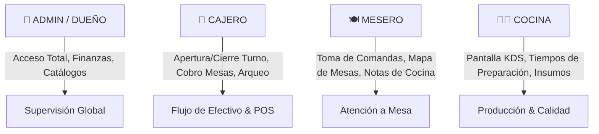

# 🌊 MAREA NEGRA — ARQUITECTURA DE ROLES & MATRIZ DE PERMISOS

> **Documento de Diseño Estratégico y Operativo**  
> *Negocio: Marea Negra — Aguachiles & Cocteles (Sinaloa, México)*  
> *Versión: 1.0 | Fecha: Septiembre 2026*

---

## 🎯 1. Filosofía de Diseño: ¿Por qué segregar roles?

En la industria gastronómica y de marisquerías de alto ritmo en Sinaloa, la operación enfrenta 3 desafíos críticos:
1. **Velocidad en horas pico:** Un mesero o cocinero no puede perder tiempo navegando menús complejos o dashboards financieros mientras tiene comandas acumuladas.
2. **Control Financiero y Prevención de Fugas:** Si cualquier persona puede modificar precios, cancelar ventas o aplicar descuentos sin supervisión, se generan desajustes en caja y "robo hormiga".
3. **Trazabilidad y Rendición de Cuentas:** Cuando hay un faltante en caja o un platillo se demora, el sistema debe saber exactamente **quién tomó la orden (`mesero_id`)**, **quién cobró (`cobrado_por`)** y **quién abrió y cerró el turno de caja**.

Aplicamos el principio estándar de ingeniería de software y seguridad empresarial: **Principio de Menor Privilegio (PoLP)** y **Segregación de Funciones (SoD)**. Cada colaborador tiene acceso *única y exclusivamente* a las herramientas necesarias para su labor.

---

## 👥 2. Definición Detallada por Rol

---

### 👑 1. ADMINISTRADOR / DUEÑO (`admin`)
* **Propósito:** Control total, toma de decisiones estratégicas y auditoría del restaurante.
* **Pantalla de Inicio:** `/admin/dashboard` (Métricas de ventas en vivo, platillo estrella, KPIs).
* **Módulos y Permisos:**
  * ✅ **Acceso Total** a todos los módulos del sistema.
  * ✅ **Gestión de Menú & Precios (`/admin/menu`):** Alta/baja de platillos, ajuste de precios, subida de fotos al Storage, control de recetas y escandallos.
  * ✅ **Gestión de Personal & Roles (`/admin/empleados`):** Crear cuentas, cambiar contraseñas de acceso, asignar PINs de 4 dígitos y desactivar personal.
  * ✅ **Cupones, Promociones & Reglas de Lealtad (`/admin/cupones`):** Definir campañas de descuento y recompensas del Club.
  * ✅ **Historial Financiero y Conciliación (`/admin/caja`):** Revisar cierres históricos, discrepancias entre dinero real vs sistema.
* **Justificación de la decisión:**
  > *Garantiza que la rentabilidad, la estructura de precios y la administración del personal permanezcan bajo control estricto del dueño o gerente general.*

---

### 🏪 2. CAJERO / PUNTO DE VENTA (`cajero`)
* **Propósito:** Custodia del flujo de efectivo, cobro de comandas y cuadre del turno.
* **Pantalla de Inicio:** `/admin/caja` (Apertura y Cierre de Turno).
* **Módulos y Permisos:**
  * ✅ **Apertura y Arqueo de Turno (`/admin/caja`):** Registrar fondo inicial de cambio, registrar entradas/salidas de caja chica (gastos de emergencia) y realizar el arqueo final (Corte Z).
  * ✅ **Cobro de Salón & Mesas (`/admin/mesas`):** Cobrar cuentas abiertas por los meseros (efectivo, tarjeta, transferencia), aplicar cupones válidos y liberar mesas.
  * ✅ **Pedidos de Mostrador & Para Llevar (`/admin/pedidos`):** Registrar pedidos directos de clientes en barra o pedidos por WhatsApp/Didi.
  * ✅ **Fidelización (`/admin/clientes`):** Registrar clientes al Club Marea Negra por número de teléfono y canjear premios acumulados.
  * ❌ **Restricciones:** No puede alterar precios del menú, no puede crear cupones a su criterio ni ver/modificar usuarios ni salarios de otros empleados.
* **Justificación de la decisión:**
  > *El cajero responde por el dinero que entra y sale de la gaveta. Al restringirle la edición de precios y la creación de cupones, se elimina el riesgo de descuentos fantasmas o manipulación de tickets.*

---

### 🍽️ 3. MESERO / SERVICIO EN SALÓN (`mesero`)
* **Propósito:** Atención ágil en mesas, captura de comandas y comunicación fluida con la cocina.
* **Pantalla de Inicio:** `/admin/mesas` (Croquis interactivo de mesas).
* **Módulos y Permisos:**
  * ✅ **Gestión de Comandas en Mesa (`/admin/mesas`):** Asignar comensales, agregar platillos con especificaciones (ej: *Aguachile Negro picor extra, sin cebolla*), agregar productos a cuentas abiertas y solicitar precuenta para el cliente.
  * ✅ **Monitoreo de Pedidos (`/admin/pedidos` & `/admin/pantalla`):** Ver cuándo los platillos de sus mesas pasan de *"En Preparación"* a *"Listo para Servir"*.
  * ❌ **Restricciones:** No puede cobrar directamente (a menos que el cajero lo autorice), no ve reportes financieros, no ve inventarios de compras ni puede cerrar caja.
* **Justificación de la decisión:**
  > *El mesero trabaja comúnmente de pie con un teléfono móvil o tablet. Necesita una interfaz táctil ultra-rápida, con botones grandes para los dedos y cero información administrativa que entorpezca la toma de orden.*

---

### 👨‍🍳 4. COCINA / KDS (`cocina`)
* **Propósito:** Preparación de platillos, control de tiempos de servicio y control básico de insumos/mermas.
* **Pantalla de Inicio:** `/admin/pantalla` (Kitchen Display System en pantalla fija).
* **Módulos y Permisos:**
  * ✅ **Pantalla KDS en Tiempo Real (`/admin/pantalla`):** Visualizar comandas ordenadas cronológicamente con temporizador de alerta (verde ➔ ámbar ➔ rojo por retraso), ver detalles de picor y notas especiales, marcar órdenes como *"Listo"*.
  * ✅ **Inventario Operativo (`/admin/inventario`):** Notificar stock bajo (ej: camarón, limón, pulpo) o registrar mermas operativas.
  * ❌ **Restricciones:** No tiene acceso a dinero, cobranza, datos de clientes ni configuración del menú.
* **Justificación de la decisión:**
  > *La cocina requiere una vista de alto contraste y tipografía grande para leer a distancia mientras cocinan. No requieren teclado físico ni funciones de cobro.*

---

## 📊 3. Matriz Comparativa de Permisos

| Módulo del Sistema | Ruta | 👑 Admin | 🏪 Cajero | 🍽️ Mesero | 👨‍🍳 Cocina |
| :--- | :--- | :---: | :---: | :---: | :---: |
| **Dashboard KPIs & Ventas** | `/admin/dashboard` | **Total** | ❌ | ❌ | ❌ |
| **Caja: Apertura & Arqueo Turno** | `/admin/caja` | **Total** | **Operativo** | ❌ | ❌ |
| **Mesas: Toma de Comanda** | `/admin/mesas` | **Total** | **Total** | **Operativo** | ❌ |
| **Mesas: Cobro & Liquidación** | `/admin/mesas` | **Total** | **Total** | ❌ | ❌ |
| **Pedidos Mostrador (Kanban)** | `/admin/pedidos` | **Total** | **Total** | **Consulta** | ❌ |
| **Pantalla Cocina (KDS)** | `/admin/pantalla` | **Total** | **Consulta** | **Consulta** | **Operativo** |
| **Inventario & Mermas** | `/admin/inventario` | **Total** | ❌ | ❌ | **Salidas/Alertas** |
| **Gestión de Menú & Precios** | `/admin/menu` | **Total** | ❌ | ❌ | ❌ |
| **Empleados & PINs** | `/admin/empleados` | **Total** | ❌ | ❌ | ❌ |
| **Cupones & Promociones** | `/admin/cupones` | **Total** | **Aplicar** | **Aplicar** | ❌ |
| **Club de Clientes** | `/admin/clientes` | **Total** | **Registro** | ❌ | ❌ |

---

## 🔒 4. Mecanismo de Seguridad: Doble Factor (Auth + PIN POS)

Para equilibrar **seguridad en la nube** con **velocidad operativa en el restaurante**, el sistema implementa una arquitectura híbrida:

1. **Autenticación en la Nube (Email + Contraseña):**
   * Cada usuario tiene credenciales reales en Supabase Auth con sesiones seguras y cookies cifradas (`httpOnly`).
   * Al iniciar sesión en `/login`, el router analiza el campo `user_metadata.rol` y redirige al empleado directamente a su espacio de trabajo sin pasos intermedios.

2. **PIN Numérico Rápido (POS Touch Pad de 4 dígitos):**
   * En terminales compartidas (como la tablet de salón o la computadora de caja), los empleados pueden autorizar acciones rápidas (ej. registrar quién tomó la mesa o quién autorizó un gasto menor) digitando su PIN en el teclado numérico en pantalla en menos de 2 segundos, sin necesidad de cerrar sesión.

---

## 📈 5. Beneficios para Marea Negra

1. **Cero descuadres en caja:** El cajero tiene un protocolo claro de inicio (fondo) y fin (arqueo físico) con ticket térmico.
2. **Mesas más rápidas:** El mesero no tiene que ir hasta la cocina a entregar papelitos; la comanda aparece al instante en la pantalla de cocina.
3. **Control total para el dueño:** El administrador puede estar fuera del restaurante y supervisar en tiempo real ventas, comandas y cortes desde su celular.
